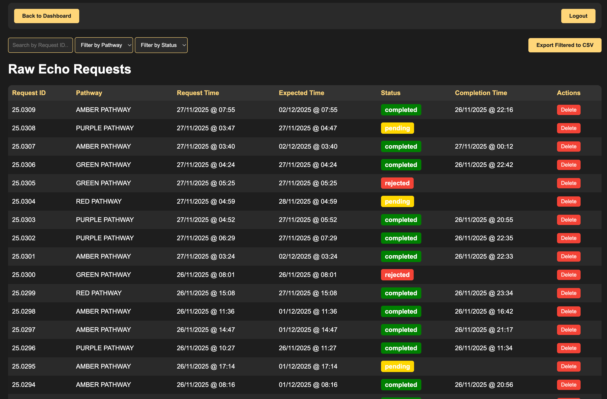

# EchoInTrack

A Flask-based web application for tracking and managing inpatient echocardiogram (echo) requests in a hospital setting. The system provides triage pathways, automated deadline calculation, and comprehensive tracking of echo request completion times.

## Features

- **Triage System**: Multiple pathways (PURPLE, RED, AMBER, GREEN/REJECTED) with different completion targets
- **Automated Deadline Calculation**: Working hours calculation excluding weekends and UK bank holidays
- **Dashboard**: Real-time statistics and visualizations
- **Request Tracking**: Monitor pending, completed, and overdue requests
- **User Authentication**: Secure login system with password management
- **Database Backups**: Automated daily backups with configurable retention
- **Patient Information**: Track name, MRN, ward, and notes for each request
- **Triage Sentence Editor**: Built-in editor for managing triage response templates

## Screenshots

### Triage Interface
The main triage interface allows staff to quickly select and copy triage response sentences for different pathways, with integrated access to clinical guidelines.


### Dashboard
Real-time dashboard showing current statistics, pending requests by pathway, and daily trends over the last 15 days.


### Raw Data View
Comprehensive table view of all echo requests with filtering, search, and export capabilities.



## Requirements

- Python 3.7+
- Flask 2.3.3+
- APScheduler 3.10.4+
- pytz 2023.3+
- werkzeug 2.3.7+

## Installation

1. Clone the repository:
```bash
git clone https://github.com/yourusername/EchoInTrack.git
cd EchoInTrack/v10
```

2. Install dependencies:
```bash
pip install -r requirements.txt
```

3. Configure the application:
   - Copy `config.json.example` to `config.json`
   - Edit `config.json` with your settings (port, wards, bank holidays)

4. Set environment variables:
   - Copy `ENV_EXAMPLE.txt` to `.env` (or set them manually)
   - Or set them in your shell:
```bash
export SECRET_KEY="your-secret-key-here"
export ADMIN_PASSWORD="your-admin-password"
export FLASK_DEBUG="False"  # Set to "True" for development
```

5. Initialize the database:
```bash
python app.py
```

The application will create the database and default admin user on first run (if `ADMIN_PASSWORD` is set).

## Configuration

Edit `config.json` to customize:
- `db_path`: Database file path (default: "echo.db")
- `backup_dir`: Directory for database backups (default: "backup")
- `max_backups`: Number of backups to retain (default: 3)
- `port`: Application port (default: 8282)
- `bank_holidays`: List of UK bank holidays (YYYY-MM-DD format)
- `wards`: List of ward names for dropdown selection

## Usage

1. Start the application:
```bash
python app.py
```

2. Access the application at `http://localhost:8282` (or your configured port)

3. Login with the admin credentials (set via `ADMIN_PASSWORD` environment variable)

4. Navigate through the interface:
   - **Triage Interface** (`/`): Select and copy triage response sentences
   - **Dashboard** (`/dashboard`): View statistics and trends
   - **Raw Data** (`/raw`): Manage and export all requests

## Triage Pathways

- **PURPLE PATHWAY**: 1 working hour target
- **RED PATHWAY**: 24 working hours target
- **AMBER PATHWAY**: 72 working hours (3 working days) target
- **GREEN PATHWAY/REJECTED**: Declined or rejected requests

## Project Structure

```
EchoInTrack/
├── v10/                # Current version (recommended)
│   ├── app.py          # Main application file
│   ├── config.json     # Configuration file (create from config.json.example)
│   ├── requirements.txt # Python dependencies
│   ├── sentences.txt   # Triage sentence templates
│   ├── templates/      # HTML templates
│   └── static/         # Static files (CSS, JS, PDFs)
├── appv6c.py           # Legacy version (deprecated, use v10/)
├── README.md           # This file
├── LICENSE             # License file
├── CONTRIBUTING.md     # Contribution guidelines
└── .gitignore          # Git ignore rules
```

**Note**: The `v10/` directory contains the current, recommended version with enhanced features. The root `appv6c.py` is a legacy version and is maintained for backward compatibility only.

## Security Notes

- **Change default password**: Always set `ADMIN_PASSWORD` environment variable before first run
- **Production deployment**: Set `FLASK_DEBUG=False` in production
- **Secret key**: Use a strong, random `SECRET_KEY` in production (minimum 24 characters)
- **Database**: Keep database files secure and backed up
- **Configuration**: Never commit `config.json` with sensitive data to version control

## Environment Variables

| Variable | Description | Required | Default |
|----------|-------------|----------|---------|
| `SECRET_KEY` | Flask session secret key | No | Randomly generated |
| `ADMIN_PASSWORD` | Password for default admin user | Yes (for first run) | None |
| `FLASK_DEBUG` | Enable Flask debug mode | No | False |

## API Endpoints

### Authentication Required
All API endpoints require authentication via session cookie.

- `POST /api/add_request` - Add a new echo request
- `GET /api/get_requests` - Get all requests
- `POST /api/mark_completed` - Mark a request as completed
- `POST /api/delete_request` - Delete a request
- `POST /api/undo_completed` - Revert a completed request to pending
- `GET /api/get_today_stats` - Get today's statistics
- `GET /api/get_daily_stats` - Get daily statistics for the last 30 days
- `GET /api/get_overdue_count` - Get count of overdue requests
- `POST /api/update_notes` - Update notes for a request
- `POST /api/update_name` - Update patient name
- `POST /api/update_mrn` - Update patient MRN
- `POST /api/update_ward` - Update patient ward

## Development

For development, set:
```bash
export FLASK_DEBUG="True"
```

This enables:
- Auto-reload on code changes
- Detailed error pages
- Debug toolbar

**Warning**: Never use debug mode in production!

## Backup System

The application automatically creates database backups:
- Scheduled daily at midnight (UK time)
- Manual backups can be created via the backup management page
- Old backups are automatically cleaned up (retains `max_backups` most recent)

## License

[Your License Here - See LICENSE file]

## Contributing

Contributions are welcome! Please feel free to submit a Pull Request.

## Support

For issues and questions, please open an issue on GitHub.

